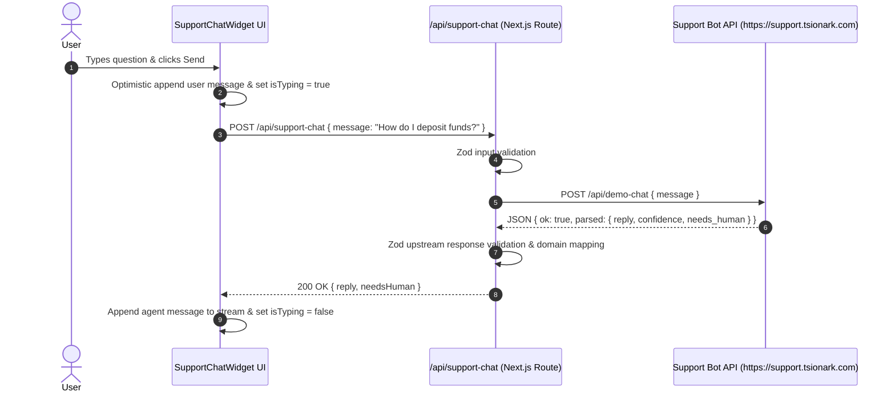

# ADR-2026-09-12: Support Chat Backend Integration with AI Agent Bot & Chatwoot API

- **Status**: Proposed
- **Date**: 2026-09-12
- **Author**: Antigravity AI
- **Deciders**: Engineering Lead, Product Lead

---

## Context

World Street SuperApp has implemented a rich interactive support chat widget UI (`components/layout/support-chat/`) featuring sanitized rich text formatting, file attachments, drag-and-drop, and localized FAQ prompt chips across 5 locales.

The backend support infrastructure is hosted at `https://support.tsionark.com` and provides:

1. **Agent Bot FastAPI Service (`https://support.tsionark.com`)**:
   - Secure TLS endpoint with loaded World Street knowledge base (non-custodial wallets, Base/Solana USDC trading, RWAs, Prediction markets, Earn, etc.).
   - Direct high-performance query endpoint: `POST /api/demo-chat` returning `{ ok: boolean, parsed: { reply: string, confidence: number, needs_human: boolean } }`.
   - Health status rollup endpoint: `GET /api/status`.
2. **Chatwoot v4.13 Server (Port 13000)**:
   - Full inbox, conversation management, agent dashboard, and webhook connection to the Agent Bot for human escalation.

We need a clean, type-safe Next.js proxy route handler and client service to connect the frontend `SupportChatWidget` to this live AI backend.

---

## Decision

1. **Proxy Boundary Handler (`app/api/support-chat/route.ts`)**:
   - Create a dedicated Next.js API route handler to proxy chat requests to `SUPPORT_CHAT_API_URL` (defaulting to `https://support.tsionark.com`).
   - Validate incoming user payloads using Zod (`{ message: string, history?: Array<{ role: 'user' | 'agent', text: string }> }`).
   - Validate upstream response payloads using Zod to enforce internal domain typing and prevent data leakage or malformed responses.
   - Implement timeout handling (15s abort controller) with graceful error fallback.

2. **Client Chat Service (`lib/support-chat/client.ts` / Hook `useSupportChat`)**:
   - Encapsulate chat dispatch, loading states, error handling, and optimistic message UI updates.
   - Replace the mock timer simulation in `support-chat-widget.tsx` with live async requests to `/api/support-chat`.
   - Support rich markdown responses returned by the bot.

3. **Multi-turn Chat Context & Fallbacks**:
   - Support chat sends user messages and receives instant AI answers synthesized from the 10.7k char World Street knowledge base.
   - If `needs_human: true` or low confidence is indicated, surface human support escalation indicators.

---

## Component Architecture

---

## Consequences

- **Positive**:
  - Live AI answers with accurate World Street knowledge (non-custodial, Base/Solana, SuperApp services).
  - No client-side CORS issues or direct backend URL exposure.
  - Strict compliance with rulebook Proxy Boundary Validation and Architectural Layering.
- **Negative / Neutral**:
  - Network latency of ~500ms–1.5s for AI inference (mitigated by immediate typing indicator).
