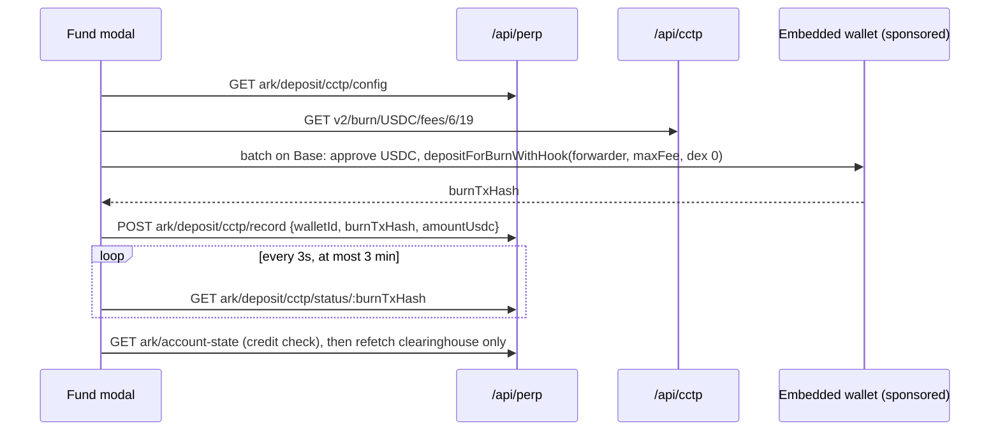

# ADR-2026-09-15: bring the perps desk onto the current Ark contract (CCTP rail)

## Status

Approved by the maintainer on 2026-09-15, on confirmation that the changes are
the ones the perps llms.txt states. Two points were settled against the backend
source (`apps/perp/src/controllers/schemas.ts` on `origin/main`) after
approval and are recorded in §4 and under Out of scope.

## Context

The perps backend (`tsionark-monorepo/apps/perp`) published a rewritten
integration guide, `apps/perp/llms.txt`, on 2026-09-14. It states that it, not
any one frontend, is the contract. Where this ADR says "the contract" it means
that file, section numbers included.

`origin/staging` (`b56f8959`) already runs the Ark desk: the 2.0 perps screen
(`hyperliquid-pro-perps.tsx`, `perp-order-ticket.tsx`), the prepare, sign and
submit write path (`hyperliquid-actions.ts`, `hyperliquid-signer.ts`), and the
proxy `app/api/perp/[...path]/route.ts`. The desk was restored on 2026-09-11
from a source that predates three backend changes. Measured against the
contract, staging is behind in four places:

| Area             | Contract                                                                                                                                                                                                                                                                    | Staging today                                                                                                                                                                                                                                         |
| ---------------- | --------------------------------------------------------------------------------------------------------------------------------------------------------------------------------------------------------------------------------------------------------------------------- | ----------------------------------------------------------------------------------------------------------------------------------------------------------------------------------------------------------------------------------------------------- |
| Top up (§6a)     | CCTP V2, Base to HyperCore in one hop: `GET ark/deposit/cctp/config`, a Base `depositForBurnWithHook`, `POST ark/deposit/cctp/record`, poll `GET ark/deposit/cctp/status/:txHash`                                                                                           | Dextopus: USDC transfer to `funding/deposit-address`, poll `funding/deposit-status` and the Arbitrum balance, then `ark/bridge/*` from Arbitrum. The contract calls this rail "legacy fallback". None of the `cctp` paths are on the proxy allowlist. |
| Withdraw (§6b)   | `withdrawals/prepare` returns `{ withdraw: {action, nonce}, fee: {action, nonce, amountUsdc} \| null }`. Both are signed. Submit carries `fee`. The Arbitrum to Base leg is CCTP. The typed amount is the total that leaves the wallet: about $1.50 in fees, $1.50 minimum. | `PreparedWithdrawal` is `{action, nonce}` and submit has no `fee`, so a withdrawal against the current backend fails to parse. The Arbitrum to Base leg is a Dextopus reroute. The fee estimate is $1 + 0.2%.                                         |
| Freshness (§10)  | Positions every 10s only while there is exposure. Orders every 30s only while one is resting. Clearinghouse never on a background timer: refetch on open, close and focus. Refetch only what an action changed.                                                             | Positions and orders every 15s unconditionally. `hooks/use-global-balance.ts` polls `ark/account-state` every 20s on every screen that shows the balance card.                                                                                        |
| De-branding (§0) | No "Hyperliquid", "HyperCore" or "HyperEVM" in any string a trader sees.                                                                                                                                                                                                    | `perps.balanceMayBridge` says "HyperCore margin" in all five catalogues. `app/terms/content.ts:55` and `app/privacy/content.ts:100` name Hyperliquid. `lib/trade/networks.ts:24` labels a HYPE holding's network "HyperEVM".                          |

The backend's author has a wsws-frontend branch, `origin/feat/perps-on-mainline`
(2026-09-14), that implements the CCTP rail. It is 146 commits behind staging,
built on the pre-2.0 desk, and cannot be merged as it stands:

- It replaces the 2.0 ticket and desk with the older `hyperliquid-order-form`
  and `hyperliquid-simple-perps`.
- It computes the withdraw amount as `(amountNum - 0.5).toString()`, float
  arithmetic on money.
- It swallows the deposit record failure (`.catch(() => {})`). In the
  platform-pays mode the record is what tells the backend to relay the mint, so
  a silent failure there can strand a burn.
- It sizes the CCTP `maxFee` from a guess ("~0.2%, min $0.02") with a comment
  saying to use Circle's live fee quote for production.
- It fetches Circle's attestation service (`iris-api.circle.com`) straight from
  the browser.

Its encoders (`lib/cctp/cctp.ts`), contract constants (`lib/cctp/config.ts`),
attestation poller (`lib/cctp/attestation.ts`) and their tests are sound and
are what this ADR reuses.

## Decision

Port the contract, not the branch. Staging's 2.0 desk stays. The rail, the
payload shapes and the polling model come across, rebuilt to this repo's rules.

### 1. The CCTP module lands in `lib/cctp/`

`config.ts`, `cctp.ts` and `attestation.ts` come from `feat/perps-on-mainline`
with their tests. They are pure: constants, calldata encoders
(`encodeApprove`, `encodeBaseToHyperCoreBurn`, `encodeArbitrumToBaseBurn`,
`encodeReceiveMessage`) and an attestation poller that takes an injected
`fetch`. `lib/` is correct because the module knows nothing about perps; the
funds flows could use it later.

### 2. Circle is reached through a route handler, not the browser

A new proxy, `app/api/cctp/[...path]/route.ts`, forwards two allowlisted GETs to
Circle's Iris API:

- `v2/messages/:sourceDomain?transactionHash=` for the attestation.
- `v2/burn/USDC/fees/:sourceDomain/:destDomain` for the live fast-transfer fee.

Neither needs a key, but routing them keeps every upstream call behind
`app/api/` (AGENTS.md defect class 7), gives one place to validate the response,
and avoids adding Circle to the browser's connect sources. The proxy answers in
the app's standard `{ success, data }` envelope, so the browser reads it with the
one transport (`createServiceClient`); the attestation poller takes a lookup
function rather than a raw `fetch`.

### 3. Top up moves to CCTP (contract §6a)

`HyperliquidFundModal` keeps its 2.0 look and swaps its mechanism:

- **`maxFee`** comes from the live fee quote, converted to base units as a
  `bigint`, plus Circle's forwarding fee when `userPaysDepositFee` is true. If
  the quote fails, the modal says so and does not burn. There is no guessed fee.
- **The fee line** shows only when `userPaysDepositFee` is true (the contract's
  product decision), with the net that lands.
- **`record` is retried** three times with backoff. If it still fails, the modal
  shows a "your deposit is being confirmed; if it has not arrived in 10 minutes,
  contact support with this reference" state carrying the burn hash. It never
  pretends the deposit failed, because the burn has already happened.
- **Status** `confirmed` or a rising `withdrawable` completes the flow. `failed`
  or `stuck` shows that state with the burn hash. The bounded wait never turns a
  still-pending deposit into an error.
- **The Dextopus path is removed from the client** (`getDepositAddress`,
  `getDepositStatus`, the `onBridge` step and the below-bridge-minimum copy that
  only that path could produce). `funding/deposit-address` and
  `funding/deposit-status` leave the proxy allowlist. `ark/bridge/*` stays: the
  order path's insufficient-margin recovery still uses it for a wallet that
  holds Arbitrum USDC.

### 4. Withdraw takes the new shape and the CCTP leg (contract §6b)

- `PreparedWithdrawal` becomes `{ withdraw: { action, nonce }, fee: { action,
nonce, amountUsdc } | null }`. `submitWithdrawal` sends `fee` as `{ action,
signature } | null`. The fee leg is signed with the existing sendAsset signer.
- **Amounts are decimal strings computed in base units.** The typed amount is
  the total. `prepareWithdrawalBodySchema` is `{ walletId, amountUsdc }`, where
  `amountUsdc` is the withdraw3 amount itself, so the platform fee has to be
  subtracted before prepare. The client subtracts the contract's $0.50, then
  compares it with the `fee.amountUsdc` the prepare response returns; if they
  differ it prepares again with the returned figure before anything is signed,
  so the total that leaves the wallet is always the typed amount. The modal shows one combined fee (the $1 venue fee plus that platform
  fee) and the net receive, and blocks below the sum. Max never overshoots
  `withdrawable`. The math lives in a pure helper with exact tests (defect
  class 4).
- The Arbitrum to Base leg becomes CCTP: a sponsored Arbitrum batch (approve,
  `depositForBurn` to Base), the attestation through `/api/cctp`, then a
  sponsored Base `receiveMessage`. It replaces the `useReroutedWithdraw`
  Dextopus call in both `withdraw` and `resumeWithdrawal`. It fails soft as it
  does today, because the withdrawal has already succeeded, and
  `withdrawals/pending` still gates any resume.

### 5. Polling follows the freshness model (contract §10)

- `useHyperliquidPositions`: `refetchInterval` is 10s while there is an open
  position or a resting order, otherwise `false`.
- `useHyperliquidOrders`: 30s while any order `isRestingOrder`, otherwise
  `false`.
- `useHyperliquidTrading` exposes `refetchClearinghouse`, `refetchPositions`
  and `refetchOrders` beside `refetchAll`. Call sites use the narrow one: a
  trigger edit or cancel refetches orders; a top-up or withdraw refetches the
  clearinghouse.
- `hooks/use-global-balance.ts` drops its 20s interval. It refetches on window
  focus (the query client default) and is invalidated by key after a top-up,
  withdraw, open or close.

### 6. De-branding (contract §0)

- `perps.balanceMayBridge` is reworded in all five catalogues to say "your perps
  margin", with no venue name.
- Every error surfaced from the perp path goes through a single `scrubVenue`
  helper before `friendlyError` shows it. The backend already de-brands; this is
  the belt to that brace.
- **Not changed by this ADR, for a maintainer decision:** the Terms and Privacy
  pages name Hyperliquid as the execution venue and as a data recipient.
  Removing a named processor from a privacy policy is a legal question, not a
  styling one. The HYPE token's "HyperEVM" network label in the portfolio
  describes a real chain the user holds a coin on, not the perps venue.

### 7. Proxy and env

- Allowlist: add `ark/deposit/cctp/(config|record|status/[^/]+)`, remove
  `funding/deposit-address/[^/]+` and `funding/deposit-status/[^/]+`.
- `PERP_API_BASE_URL` stays as it is. The contract names it as the local
  override, which is the one kind of per-service variable AGENTS.md allows.
  `docs/API_CATALOG.md` is corrected: it wrongly says the perp proxy uses
  `wsapiService("perp")`.

### Out of scope

- The branch's TP/SL projected profit and loss preview (it lives in the pre-2.0
  order form). It can follow as its own change on `perp-order-ticket.tsx`.
- Passing sibling TP/SL ids on close and the existing order id on trigger
  replace (§5, §11). The backend's own schemas have no such fields:
  `prepareClosePositionBodySchema` is `{ walletId, positionId, size?, slippagePct? }`
  and `prepareTriggerOrderBodySchema` is `{ walletId, positionId, kind, triggerPrice }`.
  The client already cancels the siblings after a close and the old trigger
  before a replace, which is the only way the API allows, so nothing changes.
- The dead Avantis leftovers (`lib/perp/types.ts`, most of `lib/perp/logic.ts`).
  Removing them is a separate cleanup.

## Consequences

- Top up takes one Base transaction and lands in about a minute instead of the
  two-hop Dextopus route, and it no longer depends on Dextopus's webhook.
- Withdrawals work against the backend as deployed. Today's shape mismatch
  breaks them.
- An idle desk with nothing open makes no repeat perp calls. The balance card
  stops polling the perp service on every page.
- The browser never talks to Circle directly; `/api/cctp` is one more proxy to
  maintain.
- If Circle's fee quote is down, top-ups are refused rather than sent with a
  guessed fee. That is the intended trade: a burn with too low a `maxFee` sits
  unminted.

## Verification

- Red then green unit tests for each behaviour above, including exact base-unit
  withdraw math, the `record` retry and stranded state, the polling gates, the
  proxy allowlist in both directions, and the `/api/cctp` proxy's path guard.
- `./scripts/preflight.sh` clean.
- A small real top-up and withdraw on the staging deployment with a funded
  wallet, before the PR merges, because the rail moves real USDC and cannot be
  proven in jsdom.
